# Issue your first credential

## Before you begin

:::info[Access]
User will require the `Credential admin` role to create the credential definition and the `Issuer` role to issue the credential.
:::

## TL;DR

If you want to fast-track issuing your first credential, work through the following steps.

- Start in the Credentials area of the Verified Orchestration admin UI and:
  - Add a new credential, confirming the card design, credential types, claim attribute fields and validity details.
  - Ensure you publish your new credential so it can be issued
- From the Credentials area of the admin UI, click through to the details of your new credential:
  - Click the **Issue credential** button to start the issuance
  - Add a new recipient identity and choose to deliver the credential “In person”
  - Enter the credential data to include in the credential
  - If you chose to include a Face check photo in the claim attribute fields, scan the QR code to complete the collection of your Face check selfie.
  - During the Issuance step, scan the QR code using the Verified IDs area of the Microsoft Authenticator app and complete the credential issuance.

## Video walkthrough 🎥

<iframe
  width="100%"
  height="500"
  src="https://www.youtube.com/embed/Q7X5dycCcbI"
  title="Guide: Create a credential"
  frameBorder="0"
  allow="accelerometer; autoplay; clipboard-write; encrypted-media; gyroscope; picture-in-picture; web-share"
  referrerPolicy="strict-origin-when-cross-origin"
  allowFullScreen
></iframe>

<iframe
  width="100%"
  height="500"
  src="https://www.youtube.com/embed/rftBnOYH-Tk"
  title="Guide: Credential issuance"
  frameBorder="0"
  allow="accelerometer; autoplay; clipboard-write; encrypted-media; gyroscope; picture-in-picture; web-share"
  referrerPolicy="strict-origin-when-cross-origin"
  allowFullScreen
></iframe>

## Detailed steps to issue your first credential

1. [Design a credential](/docs/getting-started/issue-credential#design-a-credential)
2. [Issue your new credential](/docs/getting-started/issue-credential#issue-your-new-credential)
   1. [‘In person’ credential issuance](/docs/getting-started/issue-credential#in-person-credential-issuance)
   2. [‘Remote’ credential issuance](/docs/getting-started/issue-credential#remote-credential-issuance)
3. [Confirm the credential issuance](/docs/getting-started/issue-credential#confirm-the-credential-issuance)

### Design a credential

1. From the Verified Orchestration admin UI, click through to the **Credentials** aWhat is anrea
2. Select the **Add new credential** control
   

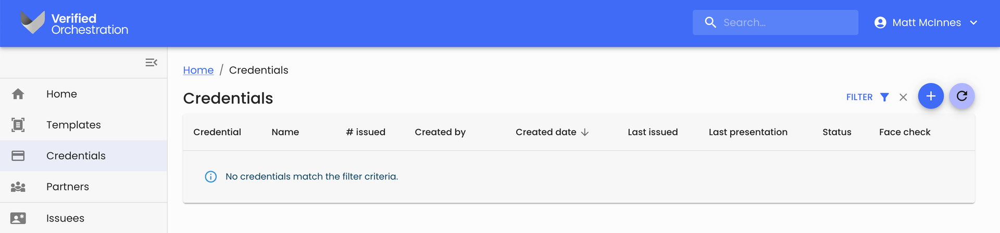

3. From the **Description** tab, enter a Name for your credential. To get started, let’s use “Member” for the name of your first credential and hit **Next**
   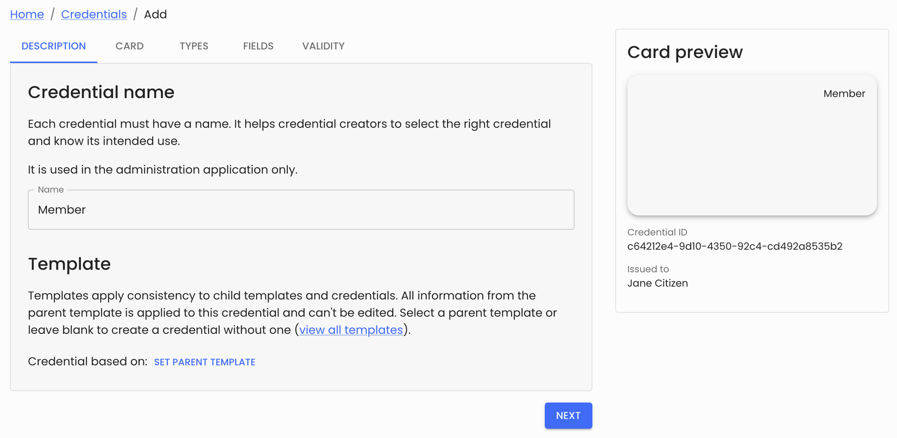
   

     <em>Enter a name for your credential</em>
   

4. From the **Card** tab, define the details that will show on the face of the credential in the Authenticator wallet, and the instructions that will be shown to users as they are issued the credential:
   1. Credential card display
      1. **Description** becomes a claim that will be issued on every credential
      2. **Issued by** is a human readable name of the issuing entity
      3. **Background colour** accepts a hex RGB code and defines the background colour of the credential preview
      4. **Text colour** accepts a hexadecimal RGB colour code, and sets the text colour shown on the credential preview
      5. You can drag and drop a logo image in JPG or PNG format
      6. **Logo description** is not shown, but satisfies accessibility requirements
   2. Credential issuance instructions
      1. **Title** is shown to the user accepting a credential during the issuance process
      2. **Instructions** is

:::note
The Card preview panel will update to show you the impact of your field inputs
:::

When you’re happy with the details in the Card tab, hit **Next** to continue

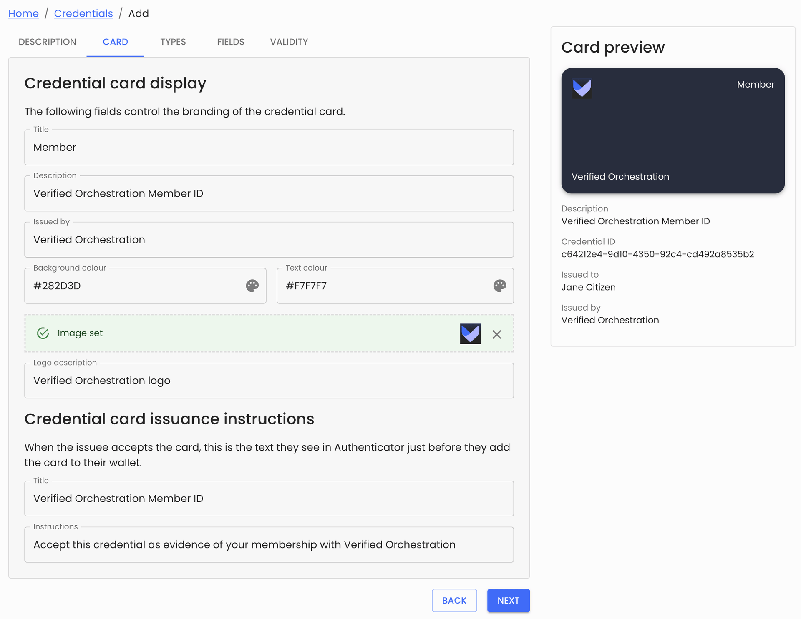

  <em>Credential card display details for our example Member ID</em>

5. From the **Types** tab, add the credential types you want to include in the credential. In the worked example of a Membership card, we will include a type of ‘Member’
   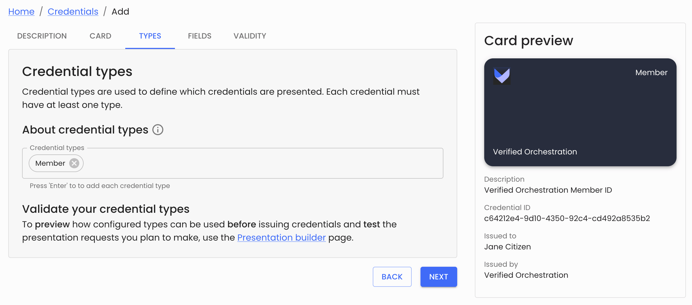
   

     <em>Define you credential types</em>
   

:::tip
You can include multiple credential types, just press ‘Enter’ to add each credential type
:::

:::warning[Caution]
If you publish this credential to the Entra network (a later step), these types will be externally discoverable.
:::

6. In the **Fields** tab, define the claims that you want to include in the credential
   1. You can require a **Face check photo** to be included in the credential
   2. Any number of **Credential fields** can be included in the credential. For the Member example, we’re just going to include a ‘Member ID’ field.

:::note
The Card preview panel will update to show you the claim attributes you’re including in the credential definition.
:::

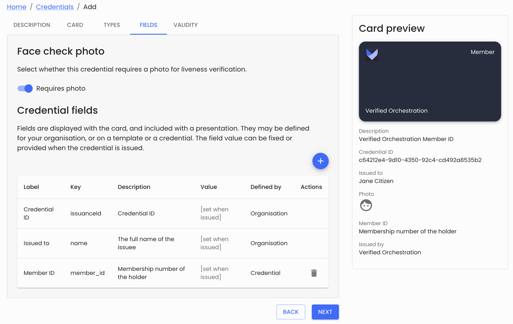

  <em>A credential field definition that requires a Face check photo and includes a Member ID</em>

When you’re happy with the Credential fields, hit **Next**

7. From the **Validity** tab
   1. Define the default validity period for our new credential
   2. Select whether to expose the credential types on the Entra network for external use

When you’re happy with the validity information, hit **Save**. You will be asked whether you want to publish this credential now. Publishing the credential is required before you it can be issued.

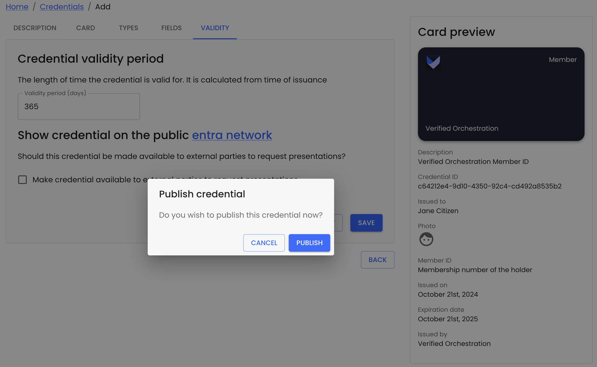

  <em>Define the validity information and publish the credential</em>

### Issue your new credential

Verified Orchestration provide a range of ways to issue credentials to an individual. These include:

1. In person issuance using the admin UI
2. Remote issuance to an individual, verifying their email and mobile number
3. Bulk remote issuance, where remote issuance can be used to distribute thousands of credentials
4. Custom integration via API of any of these methods into a customer app environment.

To get started, we’ll step you through issuing two credentials, one face-to-face and another using the remote issuance capability of the admin UI.

#### ‘In person’ credential issuance

:::info[What is an ‘In person’ issuance?]
An in person issuance is a process that is completed using the Verified Orchestration admin UI, where the operator with access to the admin UI is able to share that same interface with the intended credential recipient. This could be face-to-face or over a video meeting where a screen can be shared.
:::

1. From the **Credentials** area of the admin UI, select the Member credential we created earlier
2. Press the ‘Issue Credential’ button to start the issuance process
   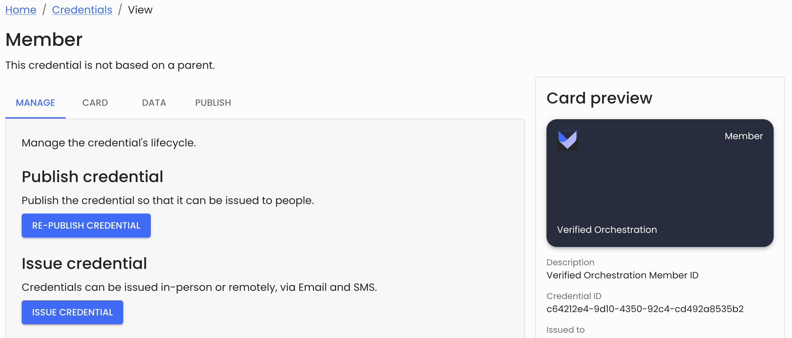
3. From the ‘Recipient’ tab of the issuance flow, enter a human readable ‘Recipient name’ string and select ‘Add “Jane Citizen”’ under the ‘Recipient name’ text input.
   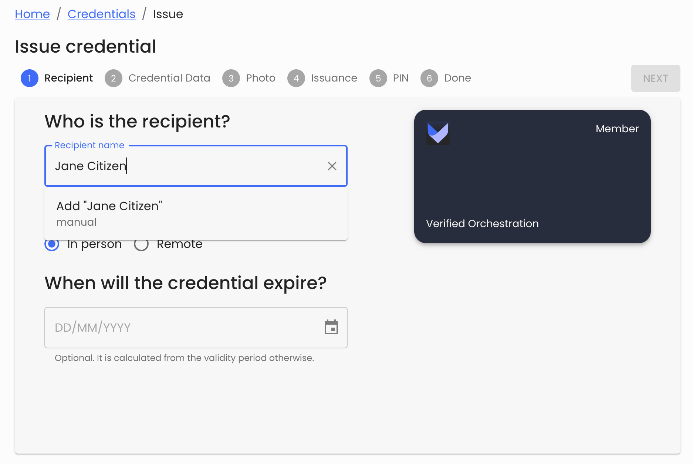
4. Finalise the identity creation by providing an email address for Jane Citizen and press ‘Add’.
   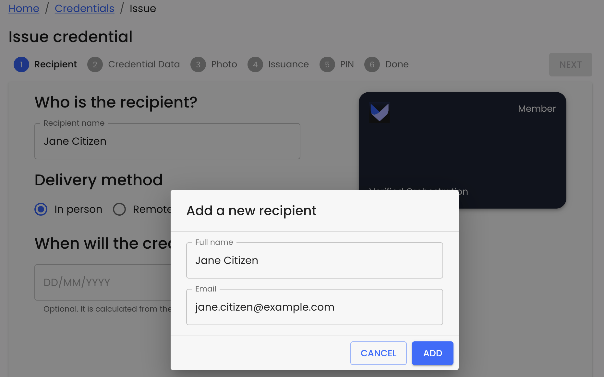
5. You will be returned to the ‘Recipient’ tab, where you can optionally set an expiry date for the credential and press ‘Next’ to move to ‘Credential Data’
   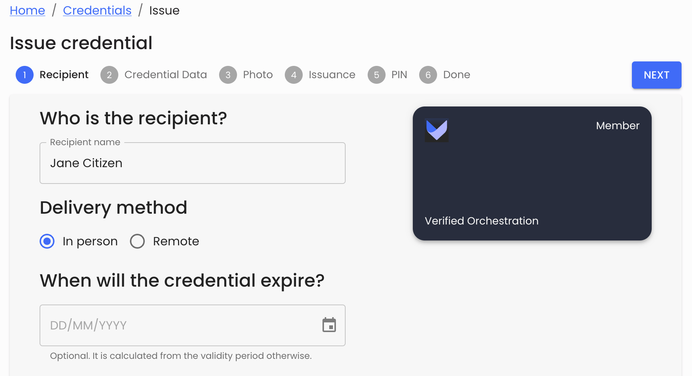
6. Provide credential data that satisfies the fields you created earlier and press ‘Next’ to continue.
   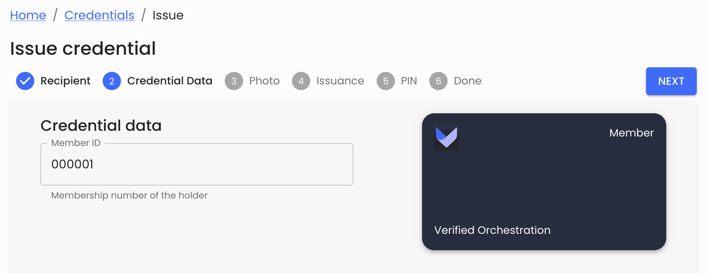
7. Because the credential fields includes a Face check photo, the ‘Photo’ capture step is required. If you have a high quality JPG image of the individual, you can upload this here, or use our ‘Capture photo' feature to have the individual supply their own selfie.
   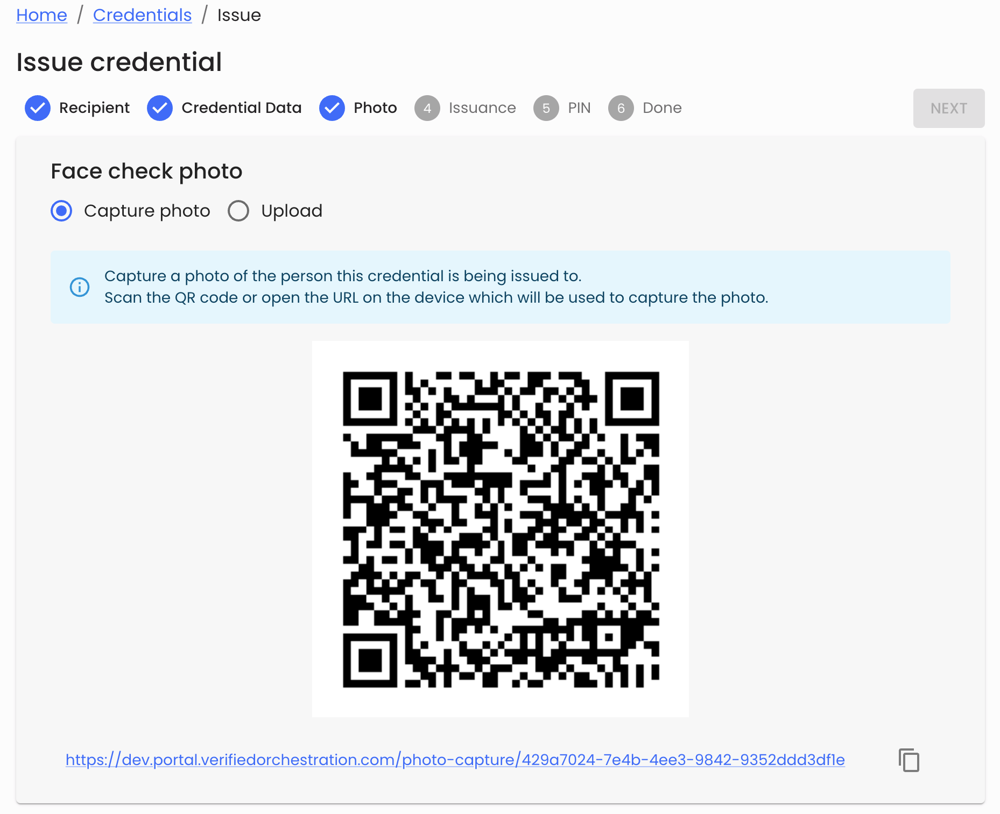
   1. To use the ‘Capture photo’ feature, have the recipient scan the QR code and complete a selfie capture and upload from their mobile device.
      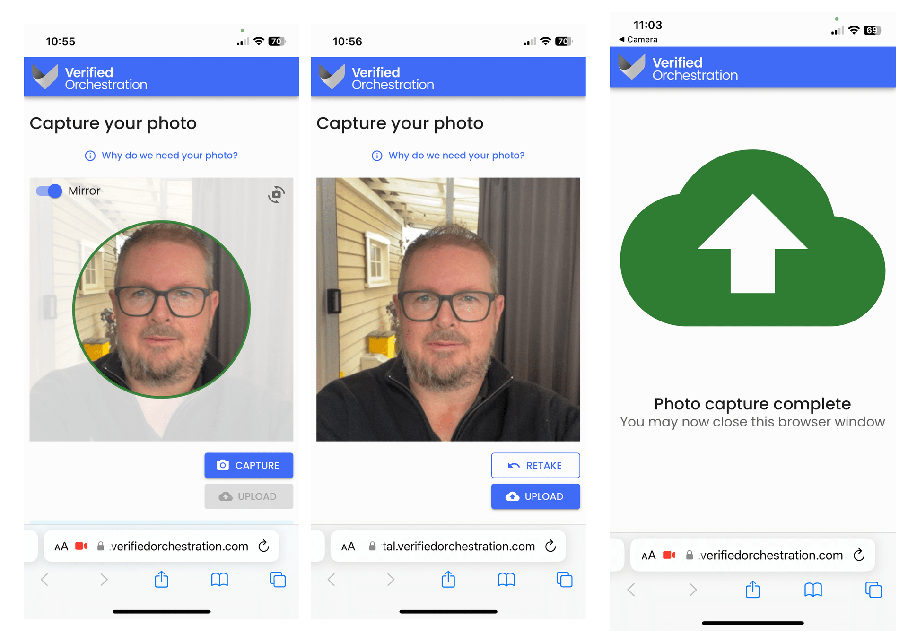
8. When the selfie capture is completed, the issuance flow will automatically move to the ‘Issuance’ tab where a second QR code will be shown. This QR code initiates the credential issuance process into the individuals Microsoft Authenticator app.
   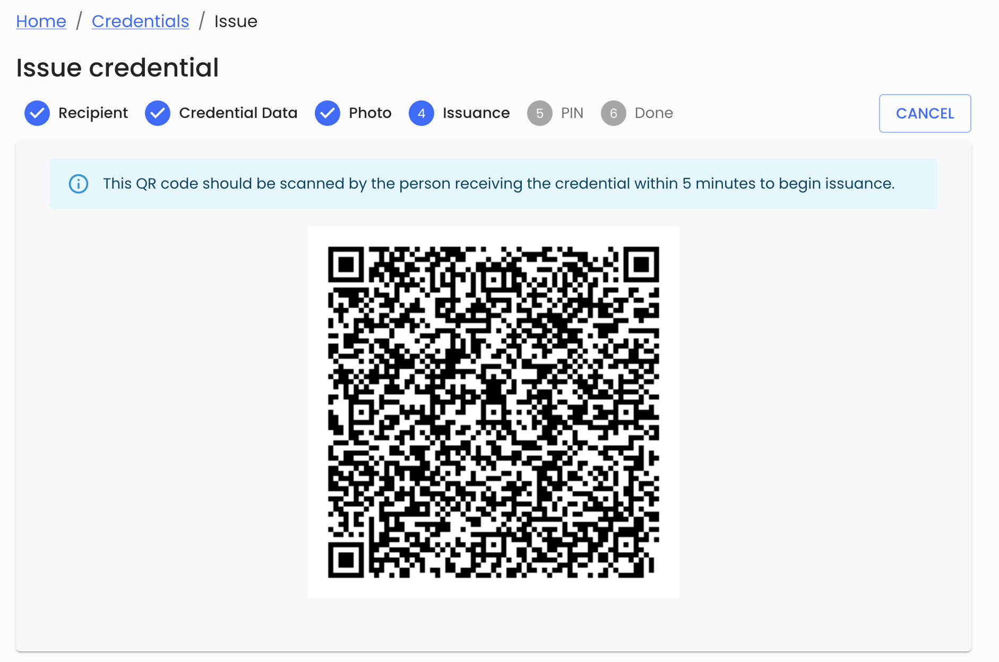
9. Your unique Verification code will be shown on screen and needs to be entered into Microsoft Authenticator by the credential recipient.
   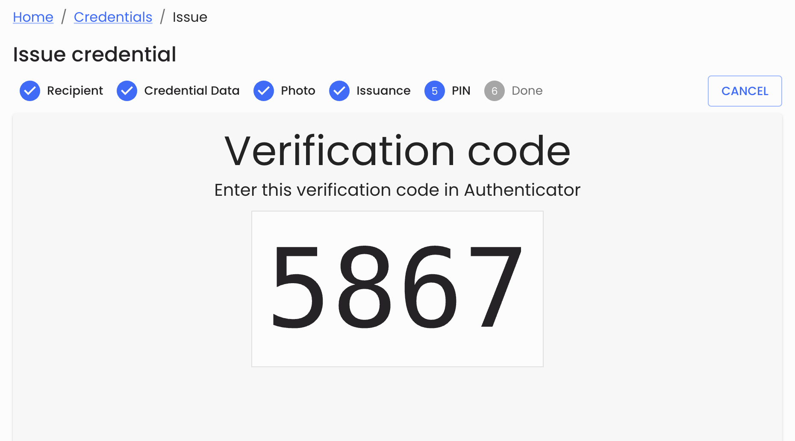
   1. The credential recipient can now complete accepting the credential into their Microsoft Authenticator app.
      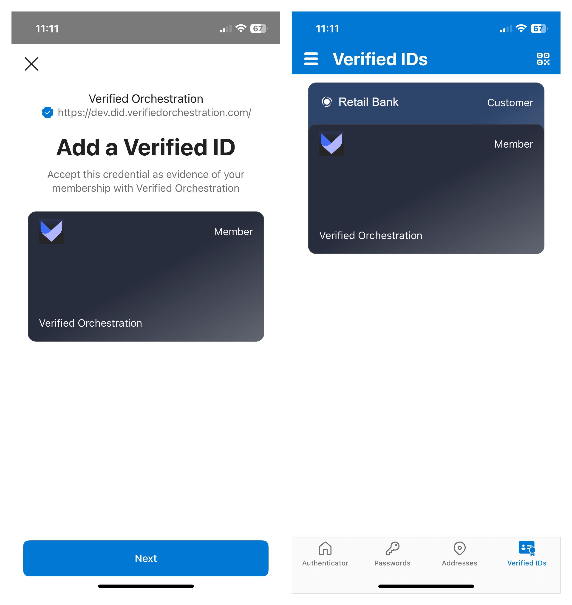
10. You have now successfully issued a credential to the recipient and the issuance flow shows you the successful green check mark.
    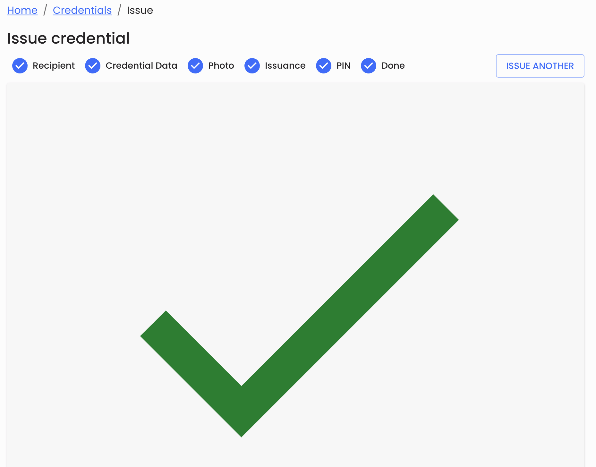

#### ‘Remote’ credential issuance

:::info[What is a remote issuance?]
Remote credential issuance is a process where the credential offer and it’s acceptance by the intended recipient is undertaken at different times. The identity of the recipient cannot be verified by their attendance, but must be verified by other means as part of the process to accept the credential into the intended recipients Microsoft Authenticator.
:::

To commence a remote credential issuance process, in the ‘Recipient’ tab of the issuance, select the ‘Delivery method’ as **Remote**.

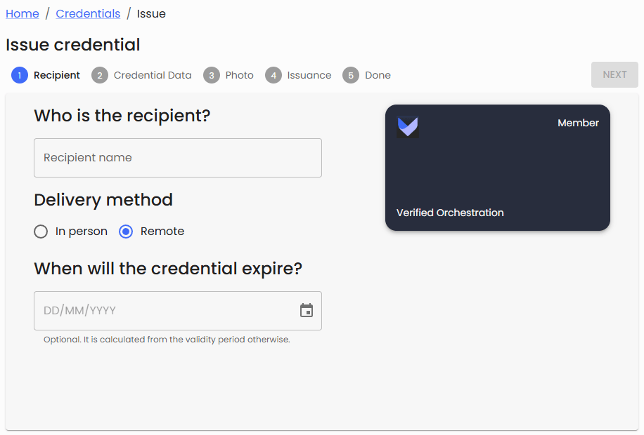

1. 2. 3. Setting up a remote issuance steps you through the same tabs to select the ‘Recipient’, ‘Credential data', and ‘Photo’, although the photo capture process is deferred and occurs as part of the recipient interaction after they receive their credential offer notification.

2. The ‘Issuance’ tab is unique to the remote issuance flow. You can setup the parameters that confirm:
   1. **Issuance expiry:** the period that the offer is valid.
   2. **Notification:** select Email (default) or SMS as the method of delivering a message that the recipient has been offered a credential.
   3. **Verification:** select Email or SMS (default) as the method of providing a one-time-pin that needs to be entered to finalise the credential issuance.

We recommend using different method for the notification and the verification to provide multiple levels of assurance that the intended recipient is receiving the credential.

When you are happy with the contact information of the intended recipient, press ‘Issue’.

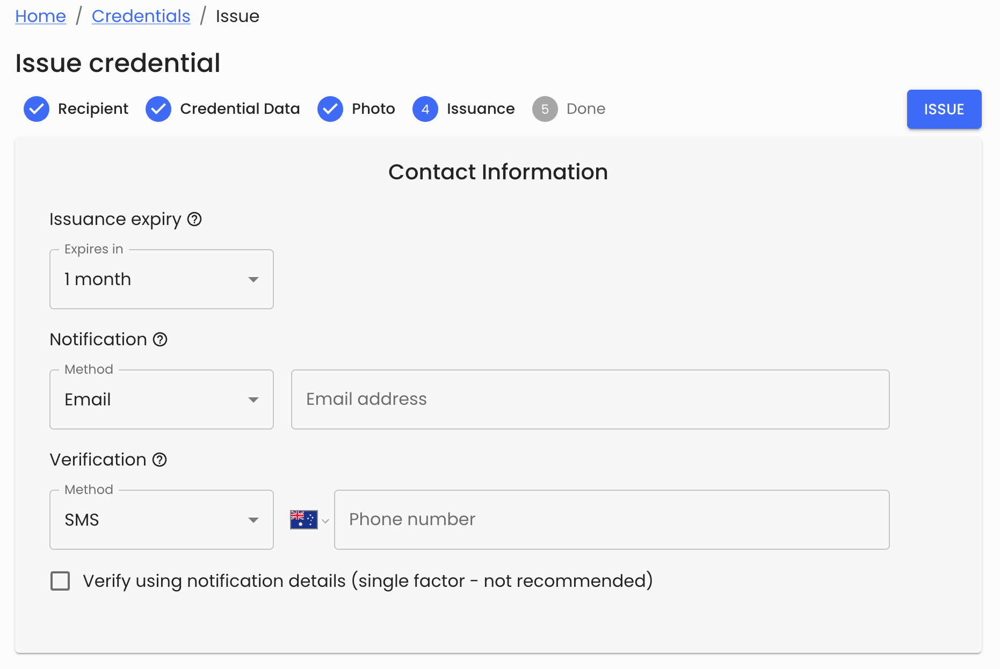

5. The intended recipient will now receive their notification, which includes a link to finalise the issuance process in Microsoft Authenticator.

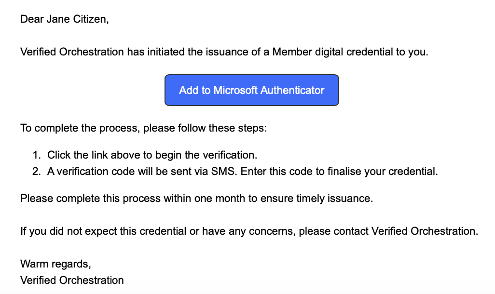

6. After clicking the link, the recipient will be directed to the final issuance page where they are asked to enter the **Verification Code**. At the same time, the verification code is delivered to the verification method and target you configured in the issuance.

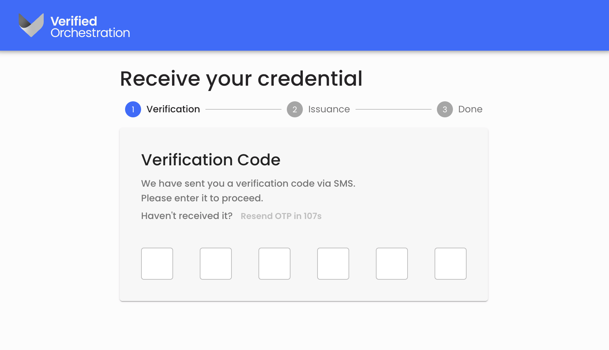

7. If the credential requires a Face check photo to be captured, the recipient will be asked to capture their selfie from our photo capture portal.
    
   
8. The final step in the issuance flow is to present the QR code to issue the credential to the recipient’s Microsoft Authenticator app.
    
   
9. The credential recipient can now complete accepting the credential into their Microsoft Authenticator app as they would with any other issuance.
   

### Confirm the credential issuance

Use the admin UI and visit the **Issuances** page. This page shows you the history of ‘In person' issuances that have been completed. This include:

- ‘In person’ issuances via the admin UI
- ‘In person’ issuances completed via other apps that use the issuance API.

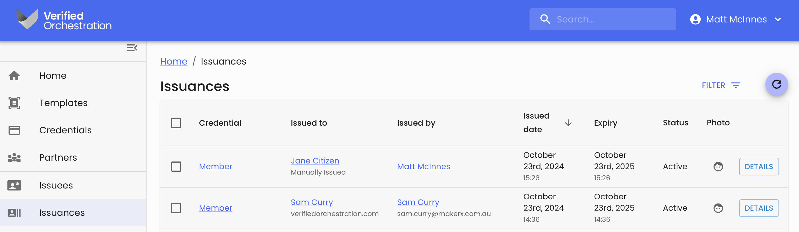

If you click through to the issuance ‘Details’, you will be presented a page that includes:

- The Credential name
- The recipient identity information and how the credential was issued
- Which user issued the credential

:::note
If the credential is issued using an integrated application, the ‘Issued by’ field will show the name of the integrated application.
:::

- When the credential was issued and when it will expire
- The current status of the credential
- Whether the credential includes a Face check photo

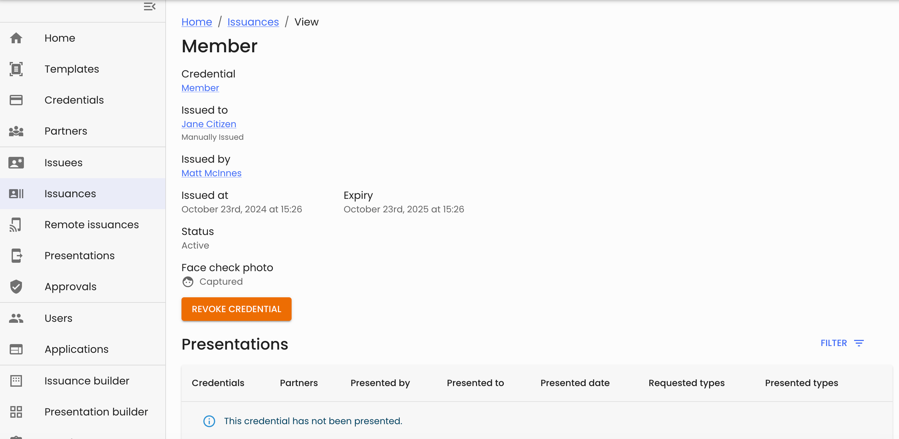
