import { ApiLink } from '@site/src/components/api-link'
import { PortalLink } from '@site/src/components/portal-link'

# Verify your first credential

## Before you begin

- You need to hold a credential in the Microsoft Authenticator wallet
- For developers, you will need a non-production instance of Verified Orchestration to use the Apollo Studio

## TL;DR

From the Presentation Builder area of the Verified Orchestration Composer:

- Select a credential to request and step to the Next stage of the presentation
- Enter a Client name as part of the Preview tab, this can be any text string at this step
- Step through the example GraphQL mutation in the Payload tab, and
- Get to the Test step, which should render you a QR code.
  - Scan the QR code from the Verified ID area of the Microsoft Authenticator app and complete the credential presentation request.
- Finally, you should see confirmation that the presentation request was successful.

From the <PortalLink path='/demo/presentation'>Verified Orchestration Concierge presentation demo</PortalLink>, you can also execute a presentation request and explore the data available as a result of the data sharing.

## Video walkthrough 🎥

Pending content

## Detailed steps to verify your first credential

### Using the Presentation Builder

Our Presentation Builder is a unique feature of the platform that:

- allows you to prepare a presentation request
- test that presentation request and verify a credential
- export the presentation request mutation to use in API call

To prepare a presentation request, in the Composer, visit the **Presentation builder** area. You will be presented the following screen:

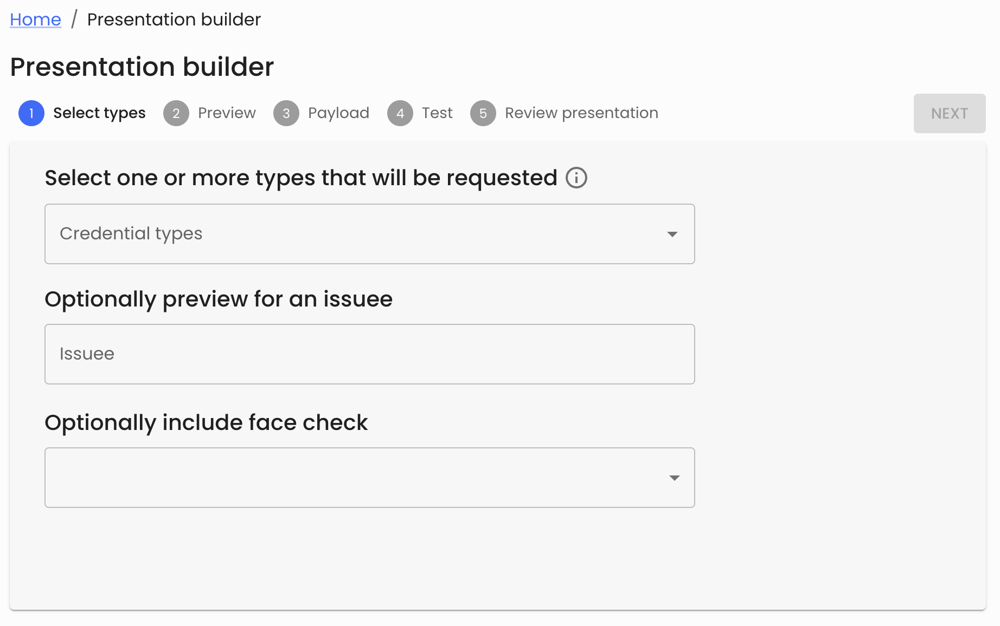

Here, you can select the credential types you want to request (see the ‘Issue your first credential’ guide if your list contains no credential types) and if one of the requested credentials includes a Face check photo, you can optionally request a face check biometric match before the credential is shared.

:::note
If you select multiple credential types in this select field, the holder of the credentials will be asked to share multiple credentials in a single request.
:::

If you select to include a Face check prior to the presentation of a credential, you will be asked to confirm the match confidence threshold that is required to pass a Face check.

  <em>Slider to set the face check confidence requirement</em>

 

Finally, you can select an issuee identity from the final dropdown to see how the presentation request will appear in the holders wallet during the presentation request. If the issuee has been issued the credential types requested, you will see those credentials below. If the issuee has not been issued all the credential types, an error will be shown.

:::note
Selecting the issuee in the Presentation Builder is only intended to help with evaluating whether the intended target of the presentation request has previously been issued the type of credential required. This issuee is not enforced in the presentation request, so any credential holder is able to scan the presentation request QR code when it is presented.
:::

<table>
  <tr>
    <td>
      <strong>Intended issuee does hold credential</strong>
    </td>
    <td>
      <strong>Intended issuee does not hold credential</strong>
    </td>
  </tr>
  <tr valign="middle">
    <td>
      
A valid presentation request where the issuee has been issued the credential type requested.

        
      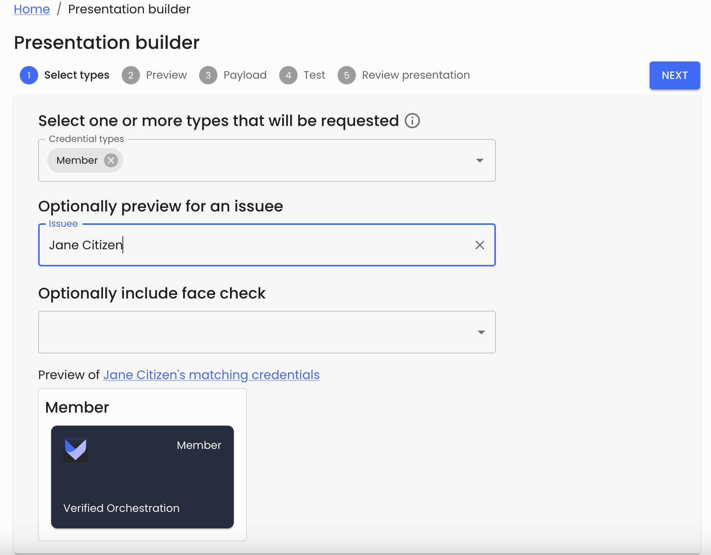
    </td>
    <td>
      
A presentation request where the issuee does not hold the credential type requested.

        
      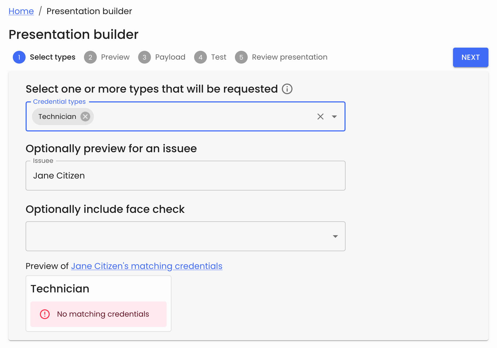
    </td>

  </tr>
</table>

  <em>An example of requesting multiple types, where the intended issuee only holds 1 of the 2 required credentials</em>

Once you’re happy with the conditions required in the presentation request, press ‘Next’ to confirm the preview of the wallet experience for the request.

Every presentation request can be tailored to clarify who or what is asking for the credential details. In a production configuration, this could be the organisation or application that is requesting the data. Our Presentation Builder allows you to enter a ‘Client name’, and the impact of that is shown in the presentation request preview below. The request will show the wallet holder:

1. The ‘Client name’ you provide
2. The verified domain of the entity requesting the data (associated with your VO tenant)
3. A human readable request to “Share with ‘Client name’” so it’s clear that the holder is being asked to explicitly share their credential data.
4. The credential or credentials that will be shared as part of the request.

<table>
  <tr valign="middle">
    <td>
      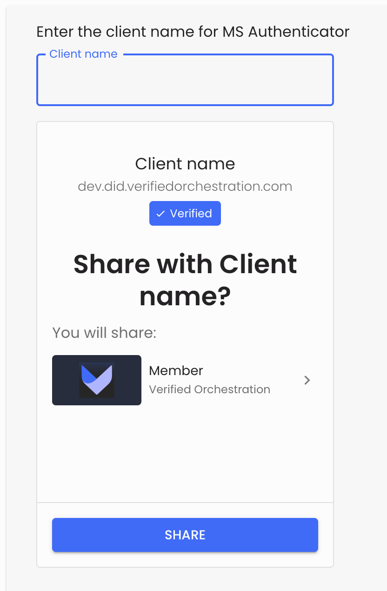
    </td>
    <td>
      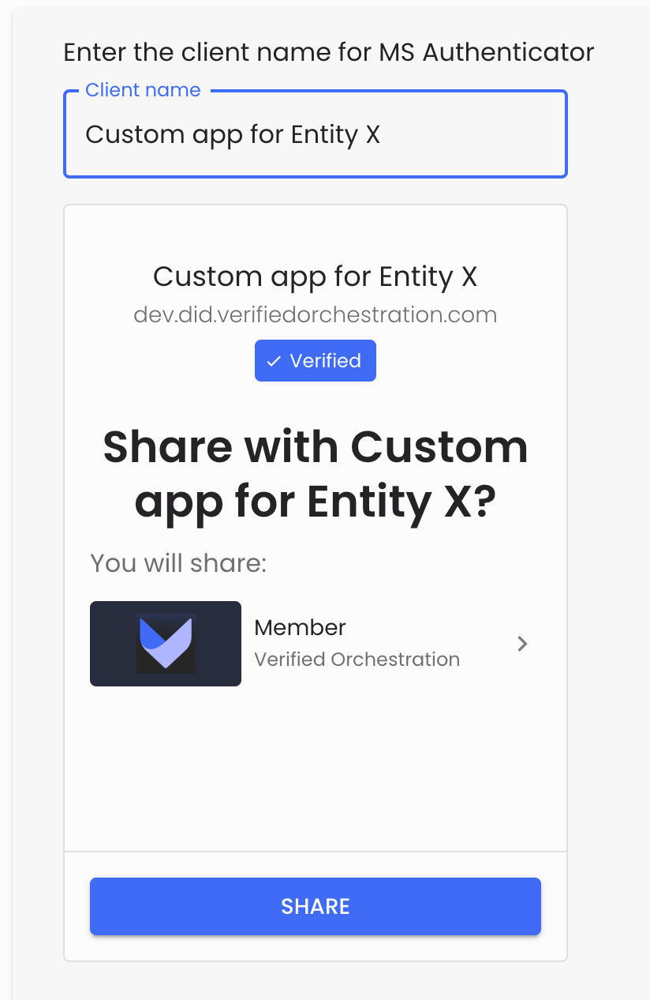
    </td>

  </tr>
</table>

Once you’re happy with the ‘Client name’ you want to use, press ‘Next’ to continue to the Payload tab of the Presentation Builder. The Payload tab of the builder is intended to provide developers the API calls and variables to prepare the presentation request in their apps, then streamline the process of testing those calls before committing them to code.

On the Payload tab, there are two toggles:

1. Whether to support presentation of a Revoked credential
2. Whether the developer wishes to receive a callback notification of the outcomes of the presentation request.

:::note
The options to accept a revoked credential and whether to receive a callback only apply to the API call setup in the Apollo Sandbox, they do not impact the presentation request that will be tested in the next step of the Presentation Builder.
:::

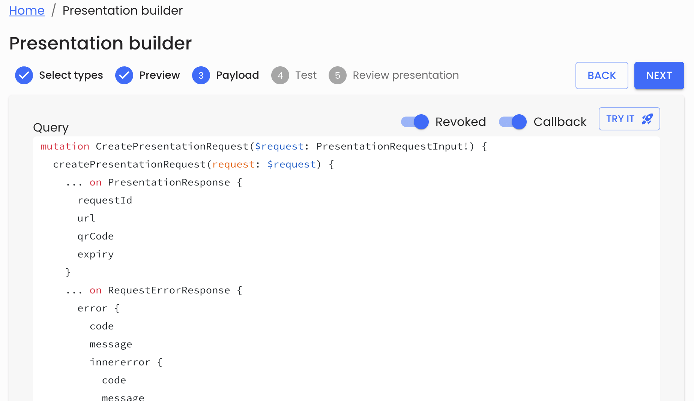

Finally, in a non-production instance of VO, there is a ‘Try it 🚀’ button that builds the presentation request in the Apollo Sandbox, ready to execute API call to initiate the presentation request. The response data includes the URI of the presentation request and the base64 encoded data that represents the presentation request URI.

:::note[**Apollo Sandbox**]
We provide the <ApiLink path='/'>Apollo Sandbox</ApiLink> for non-production instances of Verified Orchestration, to streamline the integration and testing of verifiable credentials into your applications.
:::

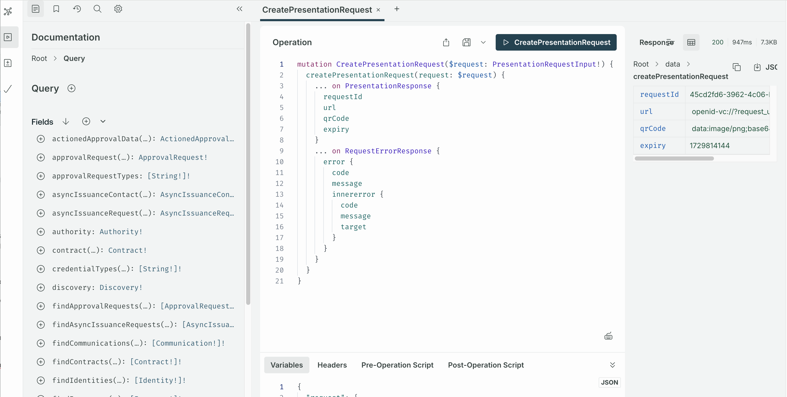

Coming back to the Presentation Builder, once you’re happy with the **Payload** parameters, press ‘Next’ to continue to the **Test** tab and you will see the QR code of the presentation request.

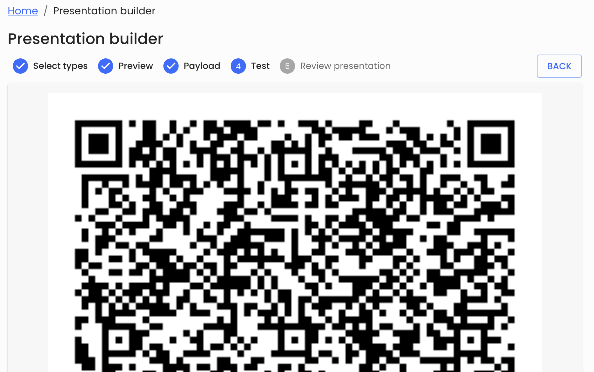

Open the Microsoft Authenticator and from the Verified IDs tab, select the QR code  icon and scan the QR code to test the presentation request.

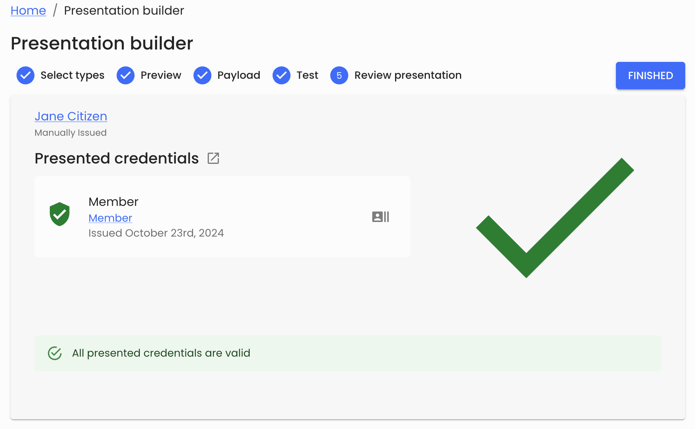

  <em>Example of the result of the successful presentation request</em>

### Using your demonstration portal

When you visit the <PortalLink path='/demo/presentation'>Concierge demo</PortalLink>, you will have a quick way to initiate a presentation request and share a credential. This request is currently the simplest and broadest request type possible, simply requesting a credential issued from the same VO tenant and accepting a global type of `VerifiableCredential`.

The first screen you will encounter renders the presentation request as a QR code, which you can scan from the Verified IDs area of the Microsoft Authenticator.

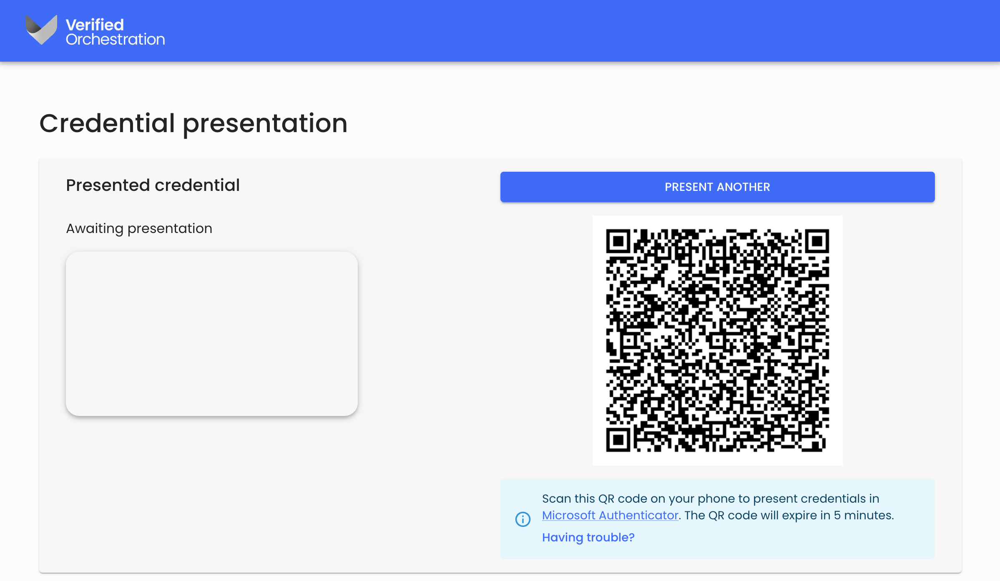

  <em>The presentation request entry screen, including the request QR code</em>

After scanning the QR code, Microsoft Authenticator will show you the credentials that match the type required in the presentation request. Select any of the credentials and press ‘Next’.

The presentation request will complete and the Concierge will show you the result of the presentation request, including additional meta-data showing:

- Credential claims
- Credential status, being either `VALID` or `REVOKED`
- Meta-data relates to the presentation request event itself
- Details of the issuer and the credential issuance
- Details of the subject or DID of the credential holder

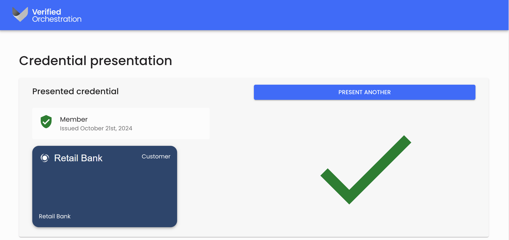

  <em>Successful presentation of a credential</em>

