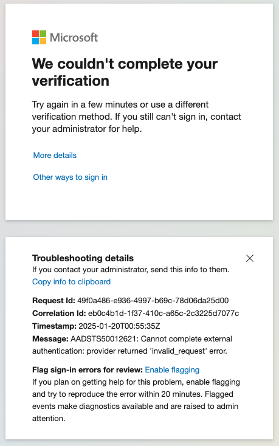
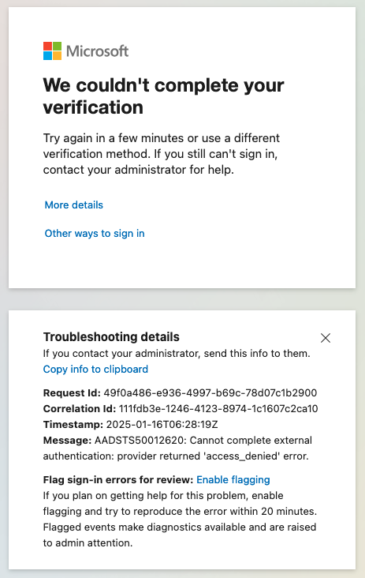
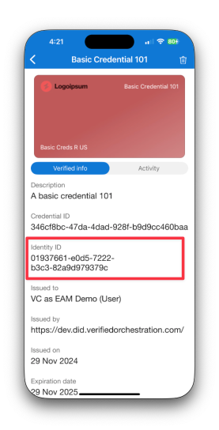
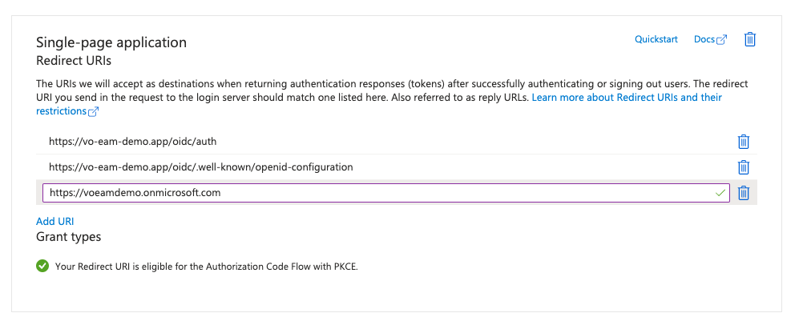
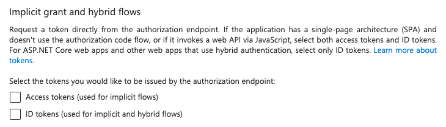
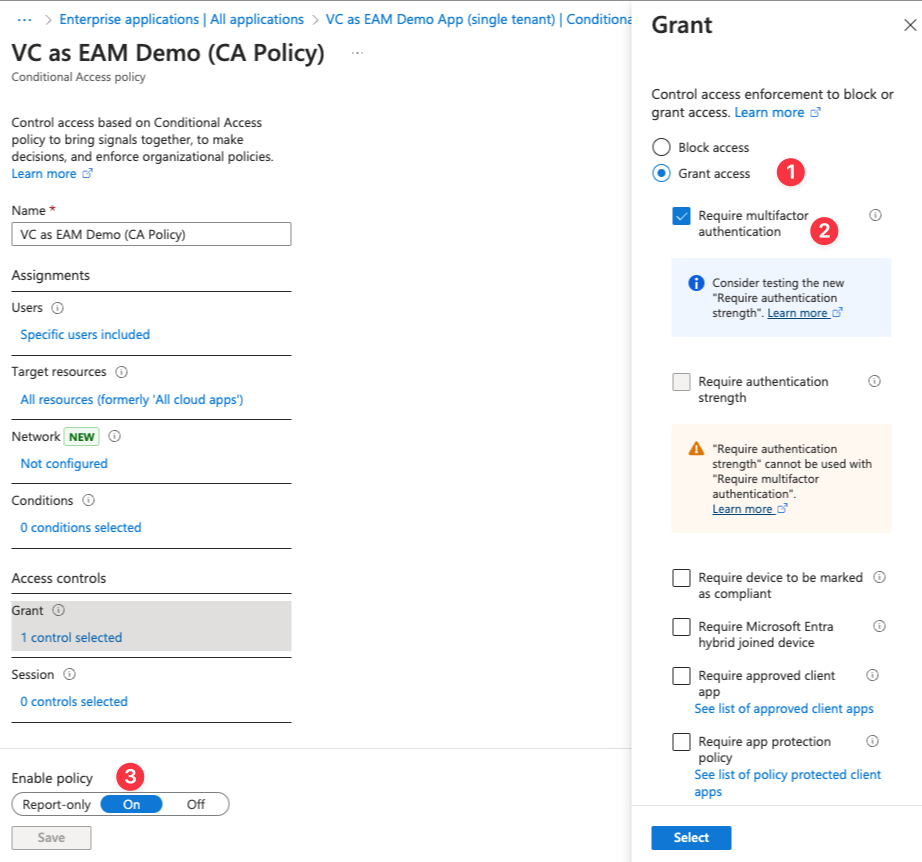
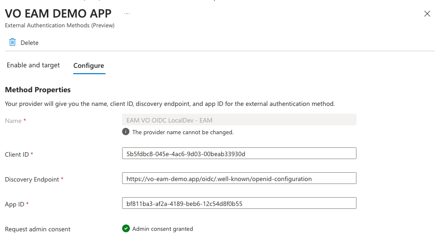

import { EntraAppRedirectAuth, EntraAppRedirectOidcMeta } from '@site/src/components/EAM'
import { Help } from '@site/src/components/Help'
import { ImgBorder } from '@site/src/components/ImgBorder'

# Entra ID EAM

An external authentication method (EAM), lets users choose an external provider to meet multifactor authentication (MFA) requirements when they sign in to Microsoft Entra ID. An EAM can satisfy MFA requirements from Conditional Access policies, Microsoft Entra ID Protection risk-based Conditional Access policies, Privileged Identity Management (PIM) activation, and when the application itself requires MFA.

## Important Information

### Release Status: Public Preview

Entra ID EAM is in [public preview](https://learn.microsoft.com/en-us/entra/fundamentals/licensing-preview-info). Public preview features carry a higher risk of change and buggy behaviour than features that are generally available.

:::danger[Caution]

Authentications flows on Mobile devices which use Entra EAM with Verifiable Credentials (VC) are not supported.

VO is working with Microsoft to resolve this issue.

:::

### Tenants

When using EAM with a tenant other than your home tenant, the VO platform must know about it. For more information, see [additional tenant IDs](/docs/guides/instance-configuration#additional-tenant-ids).

:::warning[Caution]

If the tenant ID isn't known during, the following error will be displayed to the user by Microsoft.

```
Cannot complete external authentication: provider returned 'invalid_request' error.
```
<details>
  <summary>View</summary>
  <ImgBorder>
    
  </ImgBorder>
</details>
:::

### Identities

When using EAM, the user's identity is unknown to the VO platform. Therefore, the user's identity must be resolved to an identity known by the platform. The identity resolution happens by searching for the identity using the `tid` (Tenant ID) and `oid` (Object ID) taken from the ID Token Hint passed by Entra ID during the authentication process. See [Entra ID user identity mapping](/docs/guides/identity-mapping#example-mapping-of-an-entra-id-user) for more information.

:::warning[Caution]

If the user's identity cannot be resolved during an EAM MFA authentication flow, the following error will be displayed to the user by Microsoft.

```
Cannot complete external authentication: provider returned 'access_denied' error.
```
<details>
  <summary>View</summary>
  <ImgBorder>
    
  </ImgBorder>
</details>
:::

### Credentials

To ensure the credential presented belongs to the user progressing through the EAM process, a presentation constraint is used to enforce the resolved identity ID matches to identity ID embedded in the credential. See [create presentation request](/docs/guides/presentation#create-presentation-request) for more information.

:::note
Any credentials issued prior to **1st Jan 2025** will not contain the Identity ID claim. Additionally, contracts published prior to **1st Jan 2025** will continue to issue credentials without the Identity ID claim until republished in Composer. A credential cannot be used with EAM until it is issued with the Identity ID claim included.
:::



## Set up Guide

The official documentation for setting up an EAM can be found [here](https://learn.microsoft.com/en-us/entra/identity/authentication/how-to-authentication-external-method-manage).

The general flow is:

1. Register an enterprise application/application in Entra ID.
    1. The application will be used to store key OpenID Connect (OIDC) URIs as Single Page Applications (SPA) Redirect URIs.
    2. The enterprise application will be used to enforce MFA by a Conditional Access Policy.
2. Register an OIDC client in the VO platform.
    1. The client ID will be used in the EAM OIDC configuration.
    2. The redirect URI allows the VO platform to redirect back to the Microsoft.
3. Register an authentication method in Entra ID.
    1. An external authentication method is created with the OIDC configuration.
    2. The client ID, discovery endpoint, and app ID are used to link the EAM to the OIDC client and enterprise application.

Whilst the Microsoft documentation is comprehensive, it can be a little overwhelming. To help the following additional information below is provided.

### Entra ID - Application Registration

SPA redirect URIs should be set to the following:

1. <code><EntraAppRedirectAuth /></code>
2. <code><EntraAppRedirectOidcMeta /></code>
3. <code>%Your tenant url%</code> <Help>(which should resemble the format of `https://{tenant name}.onmicrosoft.com`)</Help>



The following token options should **not** be checked:

1. Access tokens (used for implicit flows)
2. ID tokens (used for implicit and hybrid flows)

<ImgBorder>
  
</ImgBorder>

### Entra ID - Enterprise Application Registration

The associated Enterprise Application must have a conditional access policy set up to enforce MFA.

<ImgBorder>
  
</ImgBorder>

### VO Platform - OIDC Client Registration

As Entra ID's EAM uses OIDC to provide the multifactor authentication, a OIDC client registration on the VO platform must be registered and with the following details:

One of the following URIs must be used as the `Redirect URI`, but depending on the Azure instance you are using, the URI will be different. For most, the first URI will be the correct one to use.

- https://login.microsoftonline.com/common/federation/externalauthprovider (Azure)
- https://login.microsoftonline.us/common/federation/externalauthprovider (Azure US - Government)
- https://login.partner.microsoftonline.cn/common/federation/externalauthprovider (Azure - China)

### Entra ID - Authentication methods

When setting up the authentication method, the following important details are required:

1. Client ID
    1. The client ID of the Authentication Client registered in Composer.
2. Discovery Endpoint
    1. The discovery endpoint of the VO platform instance. Which is, <code><EntraAppRedirectOidcMeta /></code>.
3. App ID
    1. The ID of the Application registered in Entra ID.

<ImgBorder>
  
</ImgBorder>

:::warning[Caution]
Admin consent for the application is required in the tenant that uses the EAM. If consent isn't granted, the following error appears when an admin tries to use the EAM: AADSTS900491: Service principal `your App ID` not found.
:::
