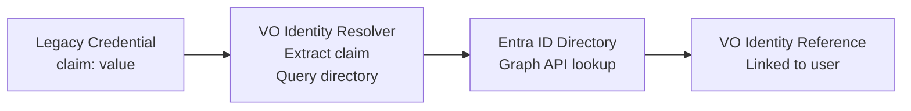

import { AdminLink } from '@site/src/components/AdminLink'

# Credential migration

This guide explains how to migrate users from existing (non-VO) verifiable credentials to VO-managed credentials. Identity resolvers allow users to authenticate with credentials issued outside of VO by mapping a claim value from the legacy credential to a user identity in your organisation's directory.

## Overview

When migrating to VO, you may have users who already hold verifiable credentials issued by another system. These users need a way to authenticate using their existing credentials while your organisation transitions to VO-managed issuance.

Identity resolvers solve this problem by:

1. Extracting a claim value from the presented credential (e.g., an employee ID, email, or unique identifier)
2. Looking up that value in your organisation's identity store (e.g., Entra ID)
3. Matching the user to their directory identity using object ID, user principal name, or email

This enables seamless authentication with legacy credentials while maintaining identity consistency with your directory.

## Prerequisites

Before configuring credential migration, ensure:

- You have an Entra identity store configured in VO with Graph API integration enabled (see [Identity stores](/docs/guides/identity-stores))
- The Graph client credentials have permissions to look up users in your directory
- Your legacy credentials contain a claim that can be mapped to a user attribute in your directory (object ID, UPN, or email)

## Configuration

### Step 1: Identify the claim to use for matching

Determine which claim in your legacy credentials contains a value that can be matched to a property of a user record in your Entra directory. The options are:

- Object ID (OID)
- User principal name (UPN)
- Email

### Step 2: Create an identity resolver

1. Navigate to the Composer authentication page.
2. Scroll down to the **Identity resolvers** section.
3. Click **Add identity resolver**.
4. Configure the resolver:

   | Field | Description |
   | ----- | ----------- |
   | **Name** | A descriptive name for this resolver (e.g., "Legacy employee credential resolver") |
   | **Credential types** | (Optional) Limit this resolver to specific credential types |
   | **Claim name** | The credential claim containing the identity value (e.g., `employeeId`, `email`, `upn`) |
   | **Identity store** | Select your Entra identity store |
   | **Lookup type** | How to match the claim value in the directory: - **Object ID**: Match against the user's Entra object ID - **User principal name**: Match against the user's UPN - **Email**: Match against the user's email address |

5. Click **Save**.

:::info
Identity resolvers rely on Graph API integration for the selected identity store. Ensure your identity store has valid Graph client credentials configured and the app registration has appropriate permissions to query user information.
:::

### Step 3: Attach the resolver to an authentication client

1. Navigate to the Composer's OIDC clients page.
2. Click **Details** on the client you want to configure (e.g., Concierge).
3. In the **Identity resolvers** section, click **Attach identity resolver**.
4. Select the identity resolver you created in the previous step.

The resolver is now active for this authentication client. Users can authenticate by presenting their legacy credentials, and VO will resolve their identity from the configured claim.

## How identity resolution works

When a user presents a credential to an authentication client with attached identity resolvers:

1. VO extracts the configured claim value from the presented credential
2. VO queries the identity store using the Graph API with the specified lookup type
3. If a matching user is found, VO creates or updates an identity reference
4. The authentication proceeds with the resolved identity

## Multiple identity resolvers

You can attach multiple identity resolvers to an authentication client. This is useful when:

- Different credential types use different claim names
- You need to support multiple identity lookup strategies
- You're migrating from several legacy credential systems

When multiple resolvers are attached, VO evaluates them in order until one successfully resolves an identity.

:::tip
Use the **Credential types** field to limit resolvers to specific credential types. This improves performance and prevents unintended matches.
:::

## More information

- [Identity stores](/docs/guides/identity-stores) - Configure Entra identity stores with Graph integration
- [Identity mapping](/docs/guides/identity-mapping) - Learn about VO identity references
- [Authentication](/docs/guides/authentication) - Configure authentication clients and resources
