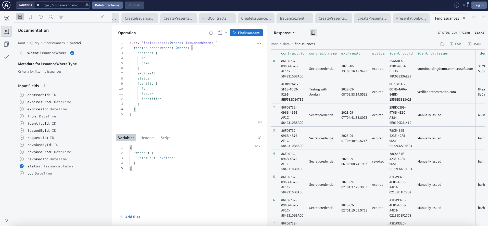
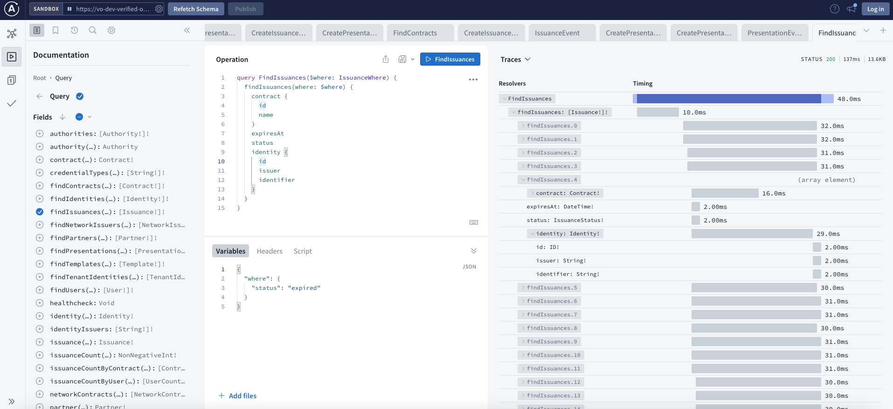
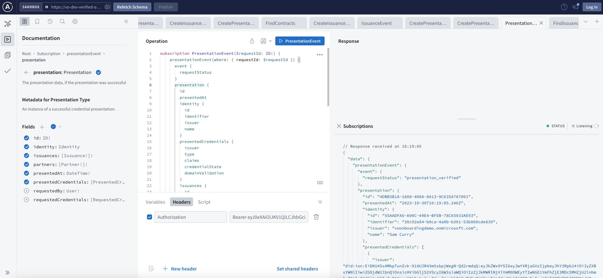

import { ApiLink } from '@site/src/components/api-link'
import { AdminLink } from '@site/src/components/admin-link'
import { RenderIf } from '@site/src/components/render-if'

# Application integration

The Verified Orchestration platform is based on a GraphQL API, facilitating seamless integration with custom applications.

We offer guidance and provide examples for the following development stacks:

- [JavaScript using client library](/docs/guides/integration/javascript-client/)
- [React + Apollo Client](/docs/guides/integration/react-apollo/)
- [iOS Swift + Apollo Client](/docs/guides/integration/ios-apollo.mdx)
- [Android Kotlin + Apollo Client](/docs/guides/integration/android-apollo.mdx)

If you're using a different development stack, our guides and examples can still serve as valuable references. The [GraphQL API](#graphql-api) section provides further details on integrating with the API using your chosen development stack.

## GraphQL API

All data and operations are accessible through the API, which presents a strongly typed, documented and discoverable schema.

<RenderIf flag='DEV_TOOLS_ENABLED'>
### Apollo Sandbox UI

Apollo Sandbox is a GraphQL IDE that enables you to explore the Verified Orchestration API. It's an ideal tool for delving into the schema, building and running queries, as well as referencing the documentation.

You will need to be [onboarded as a platform user](../onboarding-users.mdx) to access Apollo Sandbox and the API.

<ApiLink>Access Apollo Sandbox here</ApiLink>

#### Basic Apollo Sandbox usage

- Navigate the schema and select operations, types, and fields using the Documentation tab in the Explorer view.
- Define operation variables through the Variables tab.
- Utilize the Traces view to gauge the performance of your query.
- Generate a link to an operation definition using the Share button.
- Export data in JSON or CSV format.

#### Subscriptions in Apollo Sandbox

Query and Mutation operations work _out of the box_ through cookie authentication (see the _Include cookies_ setting in _Connection settings_).

To use subscription connections, which do not include cookies, you need to provide an Authorization header for the subscription operation.

1. Copy an Authorization header value from the <AdminLink>Composer</AdminLink> using your browser dev tools
1. Insert the Authorization header into the **Headers** section in Apollo Sandbox

You can now subscribe to events and see event data. Typically, an access token is valid for approximately 50 minutes, subject to your tenant configuration.

</RenderIf>
