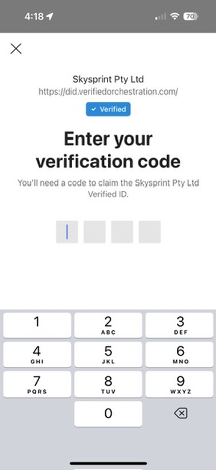
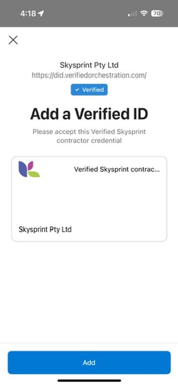

import ThemedImage from '@theme/ThemedImage'
import { AdminUrl } from '@site/src/components/admin-url'

# Issuance

Issuance is the process of adding a credential to the recipient's wallet (Microsoft Authenticator or custom wallet implementation). The recipient can then use the credential to prove claims about themselves to a verifier.

:::tip
Issuance requires user-interface components to handle several steps and the recipient to be present, to accept the credential.
Alternatively, the [remote issuance](/docs/guides/remote-issuance) feature supports issuance via email or SMS.
:::

Issuance is a multi-step process:

1. [Create an issuance request](#create-issuance-request)
1. [Display QR code or open link](#display-qr-code-or-open-link)
1. [Relay PIN to recipient (optional)](#relay-pin-to-recipient)
1. [Receive issuance notification](#receive-issuance-notification)

<ThemedImage
  alt="issuance interaction diagram"
  sources={{
    light: '/img/issuance.svg',
    dark: '/img/issuance-dark.svg',
  }}
/>

:::tip
The [JavaScript client](/docs/guides/integration/javascript-client/issuance) offers a consolidated issuance function. It can even include capturing a photo of the recipient via the [photo capture service](#photo-capture-service) for credentials that require a photo.
:::

## Create issuance request

:::tip
To create an issuance request definition and explore the API, use the <AdminUrl path="/issuance-builder">issuance builder</AdminUrl> as a starting point.
:::

The [issuance request input](/docs/reference/types/inputs/issuance-request-input) specifies:

1. Which credential will be issued
1. The identity to whom the credential will be issued (recipient / issuee)
1. Other optional input:
   1. Values of any claims defined in the contract
   1. A PIN code that the recipient must enter to retrieve the credential (best sent via a separate channel)
   1. Callback info, if issuance event data should also be sent to a server-side endpoint
   1. An expiration date to explicitly control when a credential expires, regardless of when it is issued
   1. If the credential requires a photo, either:
      - A photo of the recipient via the `faceCheckPhoto` field
      - The photo capture request ID via the `photoCaptureRequestId` field

```graphql title="CreateIssuanceRequest mutation: will return a response with issuance request or error details"
mutation CreateIssuanceRequest($request: IssuanceRequestInput!) {
  createIssuanceRequest(request: $request) {
    ... on IssuanceResponse {
      requestId
      url
      qrCode
      expiry
    }
    ... on RequestErrorResponse {
      error {
        code
        message
        innererror {
          code
          message
          target
        }
      }
    }
  }
}
```

```json title="Example variables with optional callback and PIN defined"
{
  "request": {
    "contractId": "<id of the contract to be issued>",
    "identityId": "<id of identity of recipient; or specify via identity field>",
    "includeQRCode": true,
    "callback": {
      "headers": {
        "Authorization": "MySecretTokenToCallMyEndpoint"
      },
      "url": "https://enr3r4d4gvwrb.x.pipedream.net",
      "state": "Any extra state you need to correlate the request with the callback"
    },
    "pin": {
      "value": "1234",
      "length": 4
    },
    "expirationDate": "<explicit expiry date of the credential in ISO format>"
  }
}
```

```json title="Example response of the issuance request"
{
  "data": {
    "createIssuanceRequest": {
      "requestId": "<request ID>",
      "url": "openid-vc://?request_uri=https://verifiedid.did.msidentity.com/v1.0/tenants/<tenant ID>/verifiableCredentials/issuanceRequests/<request ID>",
      "qrCode": "data:image/png;base64,iVBORw0...<base64 encoded image data>",
      "expiry": 1695285131
    }
  }
}
```

## Display QR code or open link

Once the issuance request is created, it must be opened by Microsoft Authenticator (or custom wallet application) to complete issuance.

The issuance request can be opened in one of two ways:

- On a desktop or web application, display a QR code that the recipient can scan with their mobile device.
- On a mobile application, the URL can be opened directly.

:::tip
For further info on how to handle presentation links and QR codes, see the [wallet link handling guide](/docs/guides/wallet-link-handling).
:::

### Display QR code

```tsx title="Example display QR code"

```

### Open link on mobile device

```tsx title="Example which opens the link automatically if running on a mobile device"
if ('error' in response) displayError(response.error)
else if (/Android|iPhone/i.test(navigator.userAgent)) window.location.href = response.url
else displayQrCode(response.qrCode)
```

### Handle issuance received event

Your application can subscribe to issuance events to be notified when the issuance is received by the wallet.

```graphql title="IssuanceEvent subscription notifies when issuance is A) received and B) completed successfully"
subscription IssuanceEvent($requestId: ID!) {
  issuanceEvent(where: { requestId: $requestId }) {
    event {
      requestStatus
      error {
        code
        message
      }
    }
  }
}
```

```json title="Event data when issuance is received"
{
  "data": {
    "issuanceEvent": {
      "event": {
        "requestStatus": "request_retrieved"
      }
    }
  }
}
```

:::tip
Issuance received events can be received via the IssuanceEvent subscription and the server-side callback, however you cannot poll for issuance received events because they are not stored.
:::

## Relay PIN to recipient

:::info
Use of a PIN is optional. A PIN can improve the security of issuances to help ensure the credential goes to the intended recipient.
:::

The PIN can be sent to the recipient via a separate channel (e.g. via SMS or email). Doing so can provide a higher level of confidence than displaying the PIN inline.

Alternatively, displaying the PIN after the QR code has been opened may help prevent an unauthorised party scanning a QR code and 'taking' the issuance over the intended recipient's shoulder from a distance without their knowledge.

Microsoft Authenticator will display the PIN entry screen as soon as the QR code is scanned or the link is opened.

You might send the PIN to the recipient via a separate channel at the time you create the issuance request, or wait until the issuance is received by the wallet.




If an invalid PIN is entered, an error event will be returned via the IssuanceEvent subscription and the server-side callback.

```json title="Event data when incorrect PIN is entered"
{
  "data": {
    "issuanceEvent": {
      "event": {
        "requestStatus": "issuance_error",
        "error": {
          "code": "badOrMissingField",
          "message": "issuance_service_error"
        }
      }
    }
  }
}
```

## Receive issuance notification

Upon successful issuance, the issuing application can receive data by any combination of:

1. Subscription to the issuance event
1. Polling for issuance data
1. Server-side callback

```json title="Event data when issuance is completed successfully"
{
  "data": {
    "issuanceEvent": {
      "event": {
        "requestStatus": "issuance_successful",
        "error": null
      }
    }
  }
}
```

:::tip
For complete code samples of different methods of receiving issuance events, view the issuance samples for [your development stack](/docs/guides/integration/).
:::

## Issuance with photo

If the credential requires a photo of the recipient, the photo must be supplied one of two ways:

- directly supplying a base64 encoded photo in the `faceCheckPhoto` field
- using the photo capture service to capture a photo of the recipient and supplying the `photoCaptureRequestId` field

### Photo capture service

The photo capture service allows you to generate a URL for the receipient to capture a photo. The URL can be opened in a browser on a mobile device, and the recipient can capture a photo of themselves. Once complete, the photo capture request ID can be included in the issuance.

This allows issuing applications to request a photo of the recipient without needing to implement photo capture or have access to recipient photos.

:::tip
Since the photo capture is specific to the issuee, the issuee `identityId` must be provided in the photo capture request but can be omitted from the presentation request.
:::

```graphql title="CreatePhotoCaptureRequest mutation: will return a response with the photo capture request ID"
mutation CreatePhotoCaptureRequest($request: PhotoCaptureRequest!) {
  createPhotoCaptureRequest(request: $request) {
    id
    photoCaptureUrl
    photoCaptureQrCode
  }
}
```

```json title="Example variables for photo capture request"
{
  "request": {
    "contractId": "<id of the contract to be issued>",
    "identityId": "<id of identity of recipient>"
  }
}
```

```json title="Example response of the photo capture request"
{
  "data": {
    "createPhotoCaptureRequest": {
      "id": "3eca057d-794c-4fdd-811f-b8a03a4f8567",
      "photoCaptureUrl": "https://instance.portal.verifiedorchestration.com/photo-capture/3eca057d-794c-4fdd-811f-b8a03a4f8567",
      "photoCaptureQrCode": "data:image/png;base64,iVBORw0...<base64 encoded image data>"
    }
  }
}
```

#### Photo capture completion

Photo capture progress can be monitored by:

- Subscribing to the `photoCaptureEvent` subscription
- Polling the `photoCaptureStatus` query

```graphql title="The photoCaptureEvent subscription notifies when photo capture is started and completed"
subscription PhotoCaptureEvent($photoCaptureRequestId: UUID!) {
  photoCaptureEvent(photoCaptureRequestId: $photoCaptureRequestId) {
    status
  }
}
```

```graphql title="The photoCaptureStatus query returns not_started, started and complete"
query PhotoCaptureStatus($photoCaptureRequestId: UUID!) {
  photoCaptureStatus(photoCaptureRequestId: $photoCaptureRequestId)
}
```

```json title="Example response of the photoCaptureStatus query"
{
  "data": {
    "photoCaptureStatus": "complete"
  }
}
```
