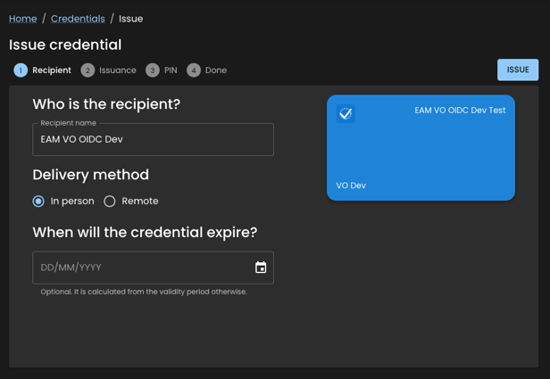
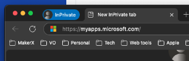
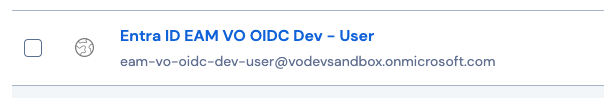
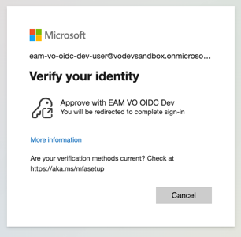
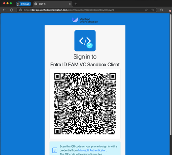
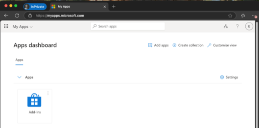

# Entra ID EAM Testing

This guide will walk you through the steps to test the Entra ID External Authentication Method (EAM) with Orchestrator.

⚠️ For **local development**, please refer to the guide in the main [readme](../../README.md).

## VO Development Environment

Steps:

1. Issue the [EAM VO OIDC Dev Test](https://dev.verifiedorchestration.com/contracts/775C763F-7361-4441-B08F-FFB1346E093D/manage) credential to yourself using the [EAM VO OIDC Dev](https://dev.verifiedorchestration.com/identities/34D0B780-25D3-4DF9-8C31-D134988895FA) identity. 
   
2. Open a new private window in your browser, and navigate to [MyApps](https://myapps.microsoft.com/). 
   
3. Sign in with the [Entra ID EAM VO OIDC Dev - User](https://vault.bitwarden.com/#/vault?itemId=9edc5f05-b7cd-4197-ad4c-b26800732284&action=view) credentials stored in Bitwarden. 
   
4. You will be requested to verify your identity, select `Approve with EAM VO OIDC Dev`. 
   
5. Scan the QR code to present the credential. 
   
6. Upon successful verification, you will be redirected to the MyApps dashboard. 
   

## VO Demo Environment

*coming soon*
